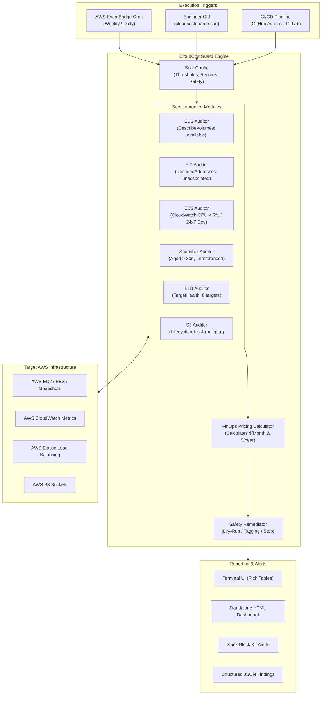

# CloudCostGuard

[]()
[](https://www.python.org/)
[](https://www.terraform.io/)
[](https://www.docker.com/)
[](LICENSE)

An automated, self-hosted FinOps tool that audits multi-region AWS environments, detects orphaned and underutilized infrastructure, calculates estimated monthly dollar waste based on AWS pricing models, and enforces tag-based cleanup workflows.

---

## Table of Contents

- [1. The Problem: Why Cloud Waste Happens](#1-the-problem-why-cloud-waste-happens)
- [2. What CloudCostGuard Does](#2-what-cloudcostguard-does)
- [3. Why CloudCostGuard? (Comparison with Alternatives)](#3-why-cloudcostguard-comparison-with-alternatives)
- [4. Architecture](#4-architecture)
- [5. Installation & Setup](#5-installation--setup)
- [6. Usage Guide](#6-usage-guide)
  - [Local Simulation Mode (No AWS Account Required)](#a-local-simulation-mode-no-aws-account-required)
  - [Live Infrastructure Scan](#b-live-infrastructure-scan)
  - [Enforcement & Tagging Workflow](#c-enforcement--tagging-workflow)
  - [Docker Execution](#d-docker-execution)
  - [Serverless Deployment with Terraform](#e-serverless-deployment-with-terraform)
- [7. Configuration & Threshold Reference](#7-configuration--threshold-reference)
- [8. Security & IAM Permissions](#8-security--iam-permissions)
- [9. Development & Testing](#9-development--testing)
- [10. Author & Support](#10-author--support)

---

## 1. The Problem: Why Cloud Waste Happens

In modern engineering teams, cloud infrastructure is provisioned rapidly across multiple development, staging, and production environments. Without continuous automated governance, accounts accumulate idle resources that run up monthly invoices without delivering business value:

1. **Unattached EBS Volumes:** When an EC2 instance is terminated, attached EBS volumes default to remaining in `available` state unless explicitly configured to delete on termination. A single 200 GB `gp3` disk left unattached costs **$16.00/month**. Across a team of 15 developers, abandoned disks easily consume hundreds of dollars per month.
2. **Idle Elastic IPs:** AWS charges **$0.005/hour** ($3.65/month) for every public IPv4 address that is allocated but not associated with a running instance. Inactive test instances that are stopped leave behind unassociated Elastic IPs that incur hourly billing 24/7.
3. **Unscheduled Non-Production Compute:** Development and QA instances (such as `m5.large` or `c5.xlarge`) frequently run around the clock. Since active development occurs roughly 40 to 50 hours a week, leaving these instances on during nights and weekends accounts for **up to 65% of their total compute cost in pure waste**.
4. **Orphaned Load Balancers:** When container workloads or microservices are retired, their Application Load Balancers (ALBs) are frequently left behind. An ALB with zero registered backend targets incurs a baseline minimum charge of **~$16.43/month** plus data processing fees.
5. **Aged Snapshots:** Database migration snapshots, manual root volume snapshots, and AMI backups remain stored in S3-backed snapshot storage ($0.05/GB-month) long after their retention requirements have expired.
6. **Unmanaged S3 Storage:** Buckets lacking object lifecycle rules and incomplete multipart upload abort policies silently retain abandoned upload chunks indefinitely.

---

## 2. What CloudCostGuard Does

CloudCostGuard provides continuous, multi-region cost governance through three core functions:

* **Automated Multi-Service Auditing:** Scans across designated AWS regions using the AWS SDK (`boto3`) to identify unattached EBS volumes, unassociated Elastic IPs, idle EC2 instances (via CloudWatch CPU utilization metrics), orphaned snapshots, zero-target load balancers, and unmanaged S3 buckets.
* **Deterministic FinOps Pricing Engine:** Instead of reporting only technical resource IDs, CloudCostGuard maps every discovered asset to official AWS pricing formulas (e.g., volume storage type, capacity in GiB, idle hours, instance type) to calculate **projected monthly and annual dollar waste**.
* **Safety-First Remediation Guardrails:** Operates in **Dry-Run mode by default**. When enforcement is enabled, it tags offending assets (`CloudCostGuard:Action=MarkedForCleanup`) rather than executing blind deletions, providing engineering teams with a clear grace period.
* **Executive & Operational Reporting:** Generates structured outputs suited for both technical and financial stakeholders:
  * Interactive terminal output formatted with KPI cards and resource tables.
  * Standalone, responsive HTML audit dashboards.
  * Real-time Slack notifications formatted using Slack Block Kit cards.
  * Machine-readable JSON exports for integration into SIEM or internal data pipelines.

---

## 3. Why CloudCostGuard? (Comparison with Alternatives)

Organizations attempting to control cloud costs typically evaluate three options: native AWS utilities, enterprise SaaS platforms, or custom scripts. Below is an engineering comparison:

| Evaluation Metric | AWS Native Tools (Budgets / Trusted Advisor) | Commercial SaaS (CloudHealth, Datadog Cost) | Ad-Hoc Scripts / AWS-Nuke | CloudCostGuard |
| :--- | :--- | :--- | :--- | :--- |
| **Pricing** | Trusted Advisor waste checks require **Business/Enterprise Support** ($100+/mo minimum). | **High Cost:** 2% to 5% of monthly AWS spend or $10,000+/year. | Free, but unmaintained. | **100% Free & Open Source.** Runs on AWS Free Tier. |
| **Data Privacy & Security** | Hosted by AWS. | **Security Risk:** Requires external cross-account IAM read/write access. Prohibited in regulated sectors. | Local execution. | **100% In-Account & Self-Hosted.** Zero data leaves your AWS environment. |
| **Per-Resource Dollar Mapping** | High-level service totals only. Does not itemize dollars per specific unattached volume. | Yes. | No. Scripts typically dump raw IDs without cost impact. | **Yes.** Models monthly and annual dollar waste per resource based on AWS on-demand rates. |
| **Operational Safety** | Manual intervention required. | Variable policy triggers. | **Dangerous:** Tools like `aws-nuke` risk catastrophic production deletions. | **Dry-Run by default.** Uses tag-based lifecycle marking (`MarkedForCleanup`). |
| **Deployment Model** | AWS Management Console. | Vendor SaaS Portal. | Manual cron on an EC2 instance. | **IaC (Terraform):** Serverless Lambda + EventBridge cron trigger. |
| **Offline / Simulation Testing** | Not supported. | Not supported. | Not supported. | **Supported (`--demo`):** Generates synthetic multi-region data without AWS bills. |

### The CloudCostGuard Advantage:
1. **Compliance-First:** Runs entirely inside your AWS boundary as an ephemeral Lambda function or local container. No telemetry or credentials are sent to external third-party servers.
2. **Actionable Financial Metrics:** Reports speak the language of both engineering and finance. Teams see the estimated dollar value of cleaning up a given resource rather than raw technical metrics.
3. **Turnkey IaC Deployment:** Deploys via Terraform in under two minutes with zero persistent server overhead.

---

## 4. Architecture



---

## 5. Installation & Setup

### Prerequisites
* Python 3.10, 3.11, or 3.12
* AWS CLI configured with valid credentials (`aws configure`) or IAM environment variables
* Optional: Docker (for containerized execution), Terraform >= 1.5.0 (for serverless deployment)

### Installation from Source

```bash
# Clone the repository
git clone https://github.com/faizalbagwan786/CloudCostGuard.git
cd CloudCostGuard

# Create and activate virtual environment (optional but recommended)
python -m venv venv
source venv/bin/activate  # On Windows: .\venv\Scripts\Activate.ps1

# Install package and dependencies
pip install -r requirements.txt
pip install -e .
```

Verify installation:
```bash
cloudcostguard --version
# Expected output: CloudCostGuard v1.0.0 - by Faizal Bagwan
```

---

## 6. Usage Guide

### a. Local Simulation Mode (No AWS Account Required)

To evaluate CloudCostGuard without connecting to live AWS infrastructure or incurring billing, use the `--demo` flag. This loads realistic synthetic data across multiple regions:

```bash
cloudcostguard scan --demo --html reports/audit.html --json-output reports/findings.json
```

Output highlights:
* Displays color-coded terminal KPI cards summarizing total waste and annual projections.
* Saves a complete executive HTML dashboard to `reports/audit.html`.
* Exports machine-readable findings to `reports/findings.json`.

Alternatively, trigger via 1-click demo scripts:
```bash
# Linux / macOS:
chmod +x scripts/run_demo.sh && ./scripts/run_demo.sh

# Windows PowerShell:
.\scripts\run_demo.ps1
```

---

### b. Live Infrastructure Scan

To execute an audit against your real AWS account, run `scan` without the `--demo` flag. CloudCostGuard performs an automatic pre-flight STS identity check (`sts:GetCallerIdentity`) before contacting regional endpoints, verifying your credentials and outputting your AWS Account ID. By default, it operates in **Dry-Run mode**:

```bash
# Scan default regions (us-east-1, ap-south-1, us-west-2) across all supported services
cloudcostguard scan

# Target specific regions and services
cloudcostguard scan \
  --regions us-east-1,eu-west-1 \
  --services ebs,eip,ec2,elb \
  --html company_audit.html

# Dispatch audit summary directly to a Slack channel
cloudcostguard scan \
  --slack-webhook https://hooks.slack.com/services/T000/B000/XXXXX
```

---

### c. Enforcement & Tagging Workflow

CloudCostGuard applies a non-destructive tagging model to establish operational grace periods before resources are deleted:

```bash
# Preview what would be tagged (Dry-run mode)
cloudcostguard scan --apply-tags

# Execute live tagging across identified waste assets
cloudcostguard scan --apply-tags --no-dry-run
```

When `--no-dry-run` is supplied, CloudCostGuard applies the following tags to flagged resources (EBS volumes, EC2 instances, Snapshots):
* `CloudCostGuard:Action` = `MarkedForCleanup`
* `CloudCostGuard:IdentifiedDate` = `YYYY-MM-DD`
* `CloudCostGuard:EstMonthlyWaste` = `XX.XX`

Engineering teams can query these tags in subsequent review cycles or configure automated lifecycle scripts to decommission resources that have remained tagged for longer than 14 days.

#### Automated EC2 Idle Stopping (Safety-Gated)

> [!WARNING]
> **State-Changing Remediation Warning**: Executing `--stop-idle-ec2 --no-dry-run` performs an active, state-changing AWS API call (`ec2:StopInstances`) that halts running compute instances. **Always test this workflow first in a dedicated sandbox or non-production AWS account before enabling it anywhere near business-critical environments.**

To mitigate the risk of unintended service disruption, CloudCostGuard enforces **two mandatory layers of defense-in-depth**:
1. **Explicit Safety Opt-In**: The `--stop-idle-ec2` flag strictly requires `--safety-opt-in` (or `--confirm-stop-ec2`). If omitted, execution halts immediately with an error.
2. **Explicit Resource Allowlist Tag**: An EC2 instance will **only** be stopped if it carries the specific opt-in tag:
   ```text
   CloudCostGuard:AutoStop = true
   ```
   * **Production Protection**: Instances tagged with `Environment` = `production`, `prod`, or `live` are not stopped, even if allowlisted.
   * **Protection Tags**: Any instance bearing `DoNotStop`, `Protected`, `Critical`, or `Compliance` tags is unconditionally skipped.
   * **Untagged & Non-Allowlisted**: Untagged instances or instances lacking `CloudCostGuard:AutoStop=true` are safely skipped.
   * **Verified Non-Prod**: Stopping is restricted strictly to confirmed non-prod environments (`dev`, `test`, `staging`, `sandbox`).

```bash
# Preview which allowlisted instances would be stopped (Safe Dry-run)
cloudcostguard scan --stop-idle-ec2 --safety-opt-in

# Execute stopping only on allowlisted, non-production instances
cloudcostguard scan --stop-idle-ec2 --safety-opt-in --no-dry-run
```

---

### d. Docker Execution

For environments where Python is not locally installed, or for integration into container orchestration platforms:

```bash
# Build the non-root container image
docker build -t cloudcostguard -f docker/Dockerfile .

# Run a live scan passing AWS credentials
docker run --rm \
  -e AWS_ACCESS_KEY_ID="$AWS_ACCESS_KEY_ID" \
  -e AWS_SECRET_ACCESS_KEY="$AWS_SECRET_ACCESS_KEY" \
  -e AWS_DEFAULT_REGION="us-east-1" \
  cloudcostguard scan --regions us-east-1,us-west-2

# Run demo scan and mount local directory to retrieve the generated HTML report
docker run --rm \
  -v "$(pwd)/reports:/app/reports" \
  cloudcostguard scan --demo --html /app/reports/docker_audit.html
```

---

### e. Serverless Deployment with Terraform

The `terraform/` directory contains an infrastructure-as-code module that deploys CloudCostGuard as an automated, scheduled AWS Lambda function.

```bash
cd terraform

# Initialize Terraform providers
terraform init

# Review execution plan
terraform plan \
  -var="aws_region=us-east-1" \
  -var="scan_regions=us-east-1,us-west-2,ap-south-1" \
  -var="schedule_expression=cron(0 8 ? * MON *)" \
  -var="slack_webhook_url=https://hooks.slack.com/services/T000/B000/XXXXX"

# Apply configuration
terraform apply -auto-approve
```

#### What this provisions:
1. **AWS Lambda Function:** Packages the CloudCostGuard engine running Python 3.12 with 256 MB memory and a 5-minute execution timeout.
2. **CloudWatch EventBridge Rule:** Triggers the Lambda on a configurable cron schedule (defaults to every Monday at 8:00 AM UTC).
3. **Least-Privilege IAM Role:** Configures fine-grained auditing permissions without wildcard administrative privileges.
4. **CloudWatch Log Group:** Configured with a 14-day retention policy for structured audit trails.

---

## 7. Configuration & Threshold Reference

All scanning thresholds can be configured through CLI options or environment variables:

| CLI Option | Environment Variable | Default Value | Description |
| :--- | :--- | :--- | :--- |
| `--regions` | `AWS_SCAN_REGIONS` | `us-east-1,ap-south-1,us-west-2` | Comma-delimited list of target AWS regions. |
| `--services` | `AWS_SERVICES` | `all` (`ebs,eip,ec2,snapshots,elb,s3`) | Comma-delimited list of services to audit. |
| `--dry-run / --no-dry-run` | `DRY_RUN` | `True` | Enforces read-only safety check when True. |
| `--apply-tags` | `APPLY_TAGS` | `False` | Attaches cleanup markers to identified assets. |
| `--stop-idle-ec2` | `STOP_IDLE_EC2` | `False` | Halts idle EC2 instances (requires `--safety-opt-in` & allowlist tag). |
| `--safety-opt-in` | `SAFETY_OPT_IN` | `False` | Explicit safety confirmation required to authorize stopping EC2 instances. |
| `--slack-webhook` | `SLACK_WEBHOOK_URL` | `None` | Incoming webhook URL for Slack notifications. |
| `--html` | `HTML_REPORT_PATH` | `None` | Destination file path for executive HTML report. |
| `--json-output` | `JSON_REPORT_PATH` | `None` | Destination file path for JSON structured findings. |

---

## 8. Security & IAM Permissions

CloudCostGuard adheres to the principle of least privilege. It requires no administrative credentials.

### Minimal Auditing IAM Policy

Attach the following policy to your execution role or CLI user for read-only auditing:

```json
{
  "Version": "2012-10-17",
  "Statement": [
    {
      "Sid": "CloudCostGuardReadAuditing",
      "Effect": "Allow",
      "Action": [
        "ec2:DescribeVolumes",
        "ec2:DescribeAddresses",
        "ec2:DescribeInstances",
        "ec2:DescribeSnapshots",
        "ec2:DescribeImages",
        "cloudwatch:GetMetricData",
        "elasticloadbalancing:DescribeLoadBalancers",
        "elasticloadbalancing:DescribeTargetGroups",
        "elasticloadbalancing:DescribeTargetHealth",
        "s3:ListAllMyBuckets",
        "s3:GetBucketLocation",
        "s3:GetLifecycleConfiguration"
      ],
      "Resource": "*"
    },
    {
      "Sid": "CloudCostGuardOptionalRemediation",
      "Effect": "Allow",
      "Action": [
        "ec2:CreateTags",
        "ec2:StopInstances"
      ],
      "Resource": "*"
    }
  ]
}
```

*Note: The `CloudCostGuardOptionalRemediation` block is only necessary if utilizing `--apply-tags` or `--stop-idle-ec2`.*

---

## 9. Pricing Methodology & Operational Scope

* **Baseline Cost Modeling:** Projected dollar waste figures are calculated using published AWS On-Demand list pricing (standard EBS storage tiers, $0.005/hr IPv4 idle allocation, compute instance types, and EBS snapshot pricing).
* **Operational Focus:** CloudCostGuard operates as an engineering hygiene and resource governance auditor. It is designed to surface immediate operational waste rather than replace enterprise billing analysis systems (such as AWS Cost and Usage Reports or AWS Cost Explorer), which factor in Savings Plans, Reserved Instance coverage, Enterprise Discount Programs (EDP), tiered volume discounts, and regional taxes.

---

## 10. Development & Testing

CloudCostGuard includes unit tests covering pricing algorithms, auditor modules, CLI argument handling, and remediation safeguards.

```bash
# Install development dependencies
pip install -r requirements-dev.txt

# Run full test suite
pytest tests/ -v

# Run tests with code coverage report
pytest tests/ --cov=cloudcostguard --cov-report=term-missing
```

### CI Pipeline
A matrix GitHub Actions workflow (`.github/workflows/ci.yml`) validates all pull requests across Python 3.10, 3.11, and 3.12, verifying linting (`flake8`), test execution (`pytest`), and Docker build integrity.

---

## 11. Author & Support

Developed and maintained by:

**Faizal Bagwan**  
*Cloud & DevOps Engineer | OCI Certified DevOps Professional*  
* **Email:** [faizalmohdrafiquebagwan@gmail.com](mailto:faizalmohdrafiquebagwan@gmail.com)  
* **GitHub:** [github.com/faizalbagwan786](https://github.com/faizalbagwan786/)  
* **LinkedIn:** [linkedin.com/in/faizalbagwan](https://www.linkedin.com/in/faizalbagwan/)

Licensed under the [MIT License](LICENSE).
